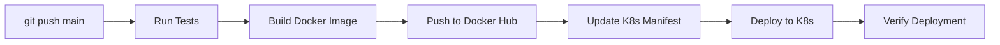

# Automated Kubernetes Deployment Setup

## Overview
Your CI/CD pipeline now includes **automated Kubernetes deployment**:
1. **Test** → **Build** → **Push to Docker Hub** → **Deploy to K8s**
2. Fully automated on every push to `main` branch
3. Uses the exact same image that was built and tested

## New Deployment Job Features

### What the `deploy` job does:
- ✅ **Runs only after successful build/push**
- ✅ **Only deploys from `main` branch** (not PRs)  
- ✅ **Updates K8s manifest** with exact image SHA
- ✅ **Applies manifests to cluster**
- ✅ **Waits for rollout completion**
- ✅ **Verifies deployment status**

## Required Setup

### 1. **Kubeconfig Secret** (Most Important)

You need to add your Kubernetes cluster credentials as a GitHub secret:

```bash
# Get your current kubeconfig (base64 encoded)
kubectl config view --raw | base64 -w 0
```

**Add this to GitHub Secrets:**
- **Secret name:** `KUBE_CONFIG`  
- **Value:** The base64 output from above

### 2. **Docker Hub Username Secret**
If not already added:
- **Secret name:** `DOCKERHUB_USERNAME`
- **Value:** Your Docker Hub username

## Deployment Flow

### Complete Automated Pipeline:


### What gets deployed:
- **Image:** `your-username/gist-server:abc123sha` (exact commit SHA)
- **Replicas:** 2 pods for high availability
- **Service:** LoadBalancer exposing port 80
- **Health checks:** Liveness and readiness probes

## Different Deployment Targets

### For Docker Desktop (Development):
```yaml
# Current setup - uses local cluster
KUBE_CONFIG: <docker-desktop-kubeconfig>
```

### For Cloud Clusters (Production):
You can deploy to any Kubernetes cluster by changing the `KUBE_CONFIG` secret:

**AWS EKS:**
```bash
aws eks update-kubeconfig --region us-east-1 --name your-cluster
kubectl config view --raw | base64 -w 0
```

**Google GKE:**  
```bash
gcloud container clusters get-credentials your-cluster --region us-central1
kubectl config view --raw | base64 -w 0  
```

**Azure AKS:**
```bash
az aks get-credentials --resource-group myRG --name myCluster
kubectl config view --raw | base64 -w 0
```

## Security Considerations

### Secrets Management:
- ✅ **KUBE_CONFIG:** Base64-encoded kubeconfig (cluster access)
- ✅ **DOCKERHUB_TOKEN:** Docker registry authentication  
- ✅ **No hardcoded credentials** in workflow files

### RBAC (Role-Based Access Control):
The kubeconfig should have minimal required permissions:
```yaml
# Minimal K8s permissions needed:
- apiGroups: ["apps", ""]
  resources: ["deployments", "services", "pods"]
  verbs: ["get", "list", "create", "update", "patch"]
```

## How to Use

### 1. **Set up secrets** (one-time setup)
### 2. **Push code to main:**
```bash
git add .
git commit -m "Add new feature"  
git push origin main
```

### 3. **Watch automated deployment:**
- GitHub Actions tab shows progress
- Deployment happens automatically  
- No manual kubectl commands needed!

### 4. **Verify deployment:**
```bash
kubectl get pods -l app=gist-server
kubectl get services gist-server-service
curl http://localhost/octocat  # If using Docker Desktop
```

## Rollback Strategy

### Automatic rollback on failure:
```bash
# If deployment fails, K8s keeps previous version running
kubectl rollout undo deployment/gist-server
```

### Deploy specific version:
```bash
# Update workflow to use specific image tag
sed -i 's|:.*|:v1.0.0|g' k8s/gist-server.yaml
git commit -m "Deploy v1.0.0" && git push
```

## Advanced Features (Future)

### Multi-environment deployment:
```yaml
# Add staging environment
deploy-staging:
  if: github.ref == 'refs/heads/develop'
  environment: staging

deploy-production:  
  if: github.ref == 'refs/heads/main'
  environment: production
  # Requires manual approval
```

### Blue/Green deployment:
```yaml
# Deploy to blue environment first
# Switch traffic after verification
# Zero-downtime deployments
```

## Monitoring

### What to monitor:
- **GitHub Actions:** Build/deploy success rates
- **Kubernetes:** Pod health, resource usage  
- **Application:** Response times, error rates

### Alerts to set up:
- Deployment failures
- High CPU/memory usage
- Application errors

This gives you a **complete GitOps workflow** - code changes automatically flow through testing, building, and deployment to Kubernetes!